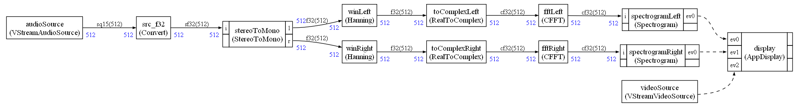

# README

Solution using CMSIS-Stream

* Audio input supported with dataflow node `VStreamAudioSource`
    - 16 kHz PCM micro.
    - Stereo signal. Q15 sample

* Audio output supported with dataflow node `VStreamAudioSink` (work in progress)
    - 48 kHz. I2S and Cirrus audio codec
    - Stereo. Q15 sample

Warning : both audio nodes are driven by an interrupt

* Camera input supported with event node `VStreamVideoSource`. Format is `RGB565`. 

* LCD display supported with `AppDisplay` event node. It is an App specific node inheriting from `VStreamVideoSink`. LCD configured in `RGB565`.

To create new display nodes, inherit from `VStreamVideoSink` and update the draw method.

`vStreamVideoSink` no more use the `vStream` CMSIS driver so will have to be renamed.

`vStreamVideoSource` use a custom `vStream` driver that is currently in `debug.c` file. It will have to be cleaned. (Otherwise every few hours there was a frame capture error with original driver)

Camera and LCD frame are allocated statically and put in specific memory sections.

Audio frames are allocated dynamically when the corresponding node is created.

Use CMSIS-RTOS2 API.

Next steps:

    1 - Add Ethos
    2 - Add multi-core
    3 - Switch to Zephyr
    4 - Use SOF

# CMSIS-Stream graph

The CMSIS-Stream graph executed by the demo:

The audio sink is a debug one.
To test with the real audio output use `debug_create.py` script instead of `create.py` to have a simple debug graph with only a sine generator and the audio output.

The audio output will soon be integrated in the big graph (sample converter required)