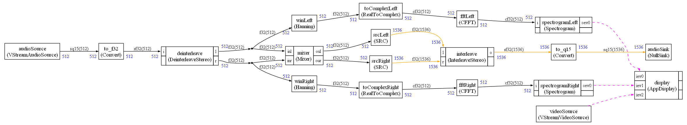
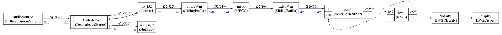
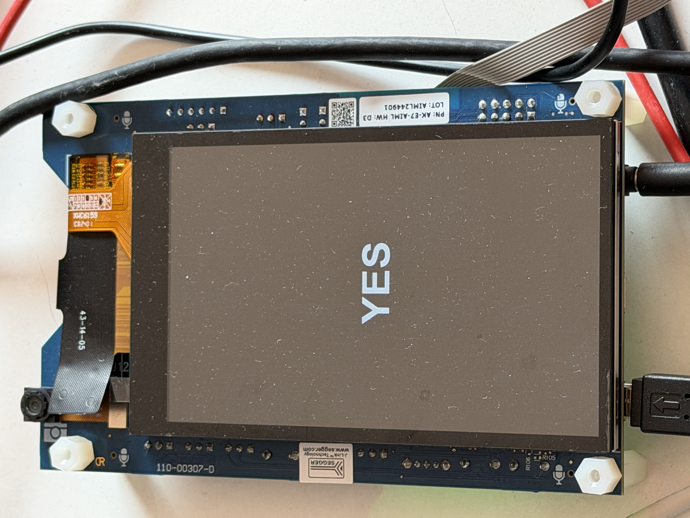

# README

## CMSIS-Stream on Alif board

This demo uses CMSIS-Stream to demonstrate on an Alif board how CMSIS-Stream unifies audio, video, AI and in a real-time context.

Two demos are provided in `App_HE/stream/python`:
- `python create.py`
    * Video demo
- `python kws.py`
    * Keyword spotting demo

You need to do a 

```
pip install cmsis-stream --upgrade
```
if you don't have at least the 2.2.0 version of CMSIS-Stream.

To switch between demos, just run a Python script and rebuild the app in vscode.

The Python scripts are just reconnecting the nodes into different graphs to implement different solutions.

Next steps:

    1 - Add multi-core and experiment with AMP
    2 - Switch to Zephyr
    3 - Use SOF for audio (and keep CMSIS-Stream for everything else)

# Video demo

The CMSIS-Stream graph executed by the demo:



It displays the camera video on the LCD and two spectrograms (left / right) computed from the audio.

It computes some FFTs and uses sample rate converter (from 16 kHz to 48 kHz).

CMSIS-DSP is used so nodes benefit from Helium acceleration.

# KWS demo

Keyword spoting demo using Ethos:



It is an adaptation of the Microspeech demo.

It is not using the ML eval kit (MLEK). The nodes are new implementations (so may deviate a little bit for MLEK). So far it looks like it is working but more check are needed to see if some bugs have not been introduced compared to the MLEK version.

MFCC is using the CMSIS-DSP Helium accelerated implementation.

CMSIS-Stream is implementing the sliding windows.

This demo focus on flexibility. Some memory optimization may be possible by building less generic nodes.

The MFCC is float because quantization is done on TFLite side using the quantization scheme for a specific network.

So we cannot send `q7` and do the computations in `q7` since the format is not `q7`. We only know it is coded on `int8` but only the `TFLite` node has access to the tensor to know which conversion must be done.

The recognized keywords are displayed on the LCD.

This should be tested in a __quiet__ environment.
Some noise reduction nodes may be helpful.

The `KWSClassifier` node must be tuned and improved (how long should the moving average be ?)

`KWS` nodes inherit from `TFLite` node. It should be possible to support different networks easily. The `TFLite` node is generic (but more data conversion formats must be supported at input and output. And currently output of the node is float and should be configurable)

The output of the graph is a node `KWSDisplay` that displays the recognized keyword on the LCD:




# CMSIS-Stream node details
Different CMSIS-Stream nodes are used in the demos:


* Audio input supported with dataflow node `VStreamAudioSource`
    - 16 kHz PCM micro.
    - Stereo signal. Q15 sample

* Audio output supported with dataflow node `VStreamAudioSink`
    - 48 kHz. I2S and Cirrus audio codec
    - Stereo. Q15 sample

Warning : by default audio nodes are dataflow master. It can be changed from Python script.

* Camera input supported with event node `VStreamVideoSource`. Format is `RGB565`. 

* LCD display supported with `AppDisplay` event node. It is an App specific node inheriting from `VStreamVideoSink`. LCD configured in `RGB565`.


To create new display nodes, inherit from `VStreamVideoSink` and update the draw method.

Need to updates comments about `vStream` CMSIS-Stream nodes. They'll need to be re-implemented.

Camera and LCD buffers are allocated statically and put in specific memory sections.

Audio buffers are allocated dynamically once when the corresponding node is created.

Uses CMSIS-RTOS2 API.

## Lib Speex

A customized Lib Speex (with some Helium optimizations) has been included.
One node (SpeexPreprocess) is available and enable noise reduction.

It is not used in the KWS example because the NN is not working very well on the output of this SpeexPreprocess node.
